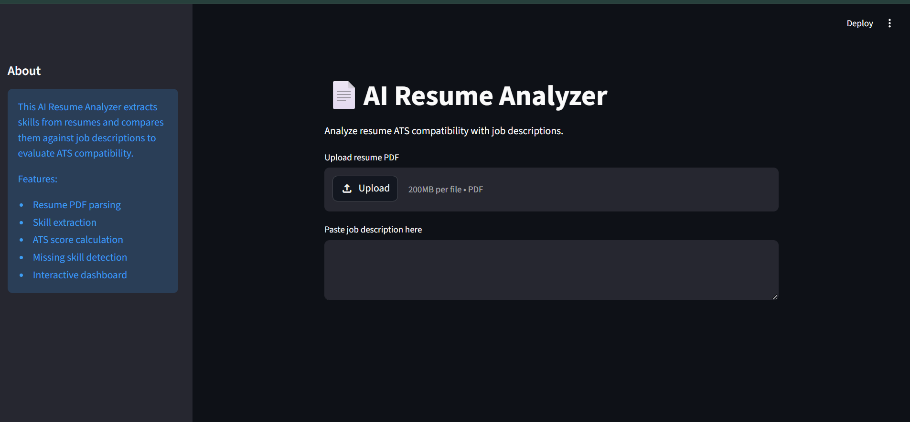
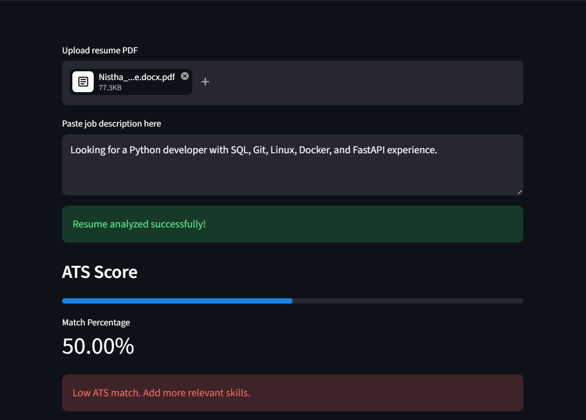
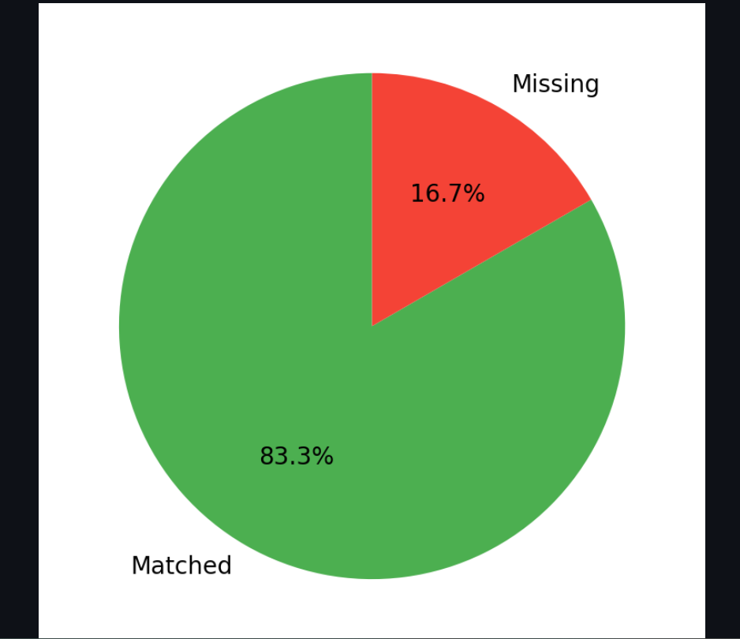
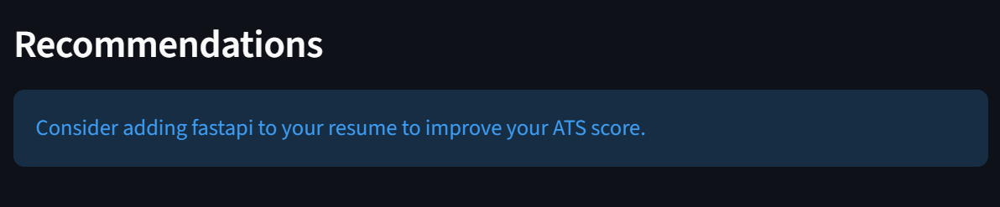

# 📄 AI Resume Analyzer

An AI-powered Resume Analyzer built using Python and Streamlit that evaluates ATS (Applicant Tracking System) compatibility between resumes and job descriptions.

The application extracts technical skills from uploaded PDF resumes, compares them against job requirements, calculates ATS match scores, identifies missing skills, and provides improvement recommendations through an interactive analytics dashboard.

---

## Live Demo

(https://ai-resume-analyzer-0526.streamlit.app/)

---

# Features

- Upload Resume PDF
- Extract text from resumes
- Detect technical skills automatically
- Categorized skill extraction
- Compare resume skills with job descriptions
- Calculate ATS compatibility score
- Identify matched and missing skills
- Generate resume improvement recommendations
- Interactive analytics dashboard
- Pie chart visualization
- Downloadable ATS analysis report

---

# Screenshots

## Homepage



---

## ATS Analysis



---

## Skill Match Visualization



---

## Recommendations



---

# How It Works

```text
Upload Resume PDF
        ↓
Extract Resume Text
        ↓
Detect Skills Using Regex Matching
        ↓
Compare With Job Description
        ↓
Calculate ATS Score
        ↓
Generate Recommendations
        ↓
Display Analytics Dashboard
```

---

# Tech Stack

- Python
- Streamlit
- PyPDF2
- Pandas
- Matplotlib
- Regex (`re` module)

---

# Project Structure

```text
AI-Resume-Analyzer/
│
├── app.py
├── parser.py
├── skills.py
├── scorer.py
├── recommendations.py
│
├── requirements.txt
├── README.md
├── .gitignore
│
├── assets/
│   ├── homepage.png
│   ├── ats_result.png
│   ├── pie_chart.png
│   └── recommendations.png
│
├── sample_resume/
│
└── venv/
```

---

# Modules

## `app.py`

Main Streamlit application containing the dashboard UI and workflow.

## `parser.py`

Extracts text from uploaded PDF resumes using PyPDF2.

## `skills.py`

Performs regex-based technical skill extraction and categorization.

## `scorer.py`

Calculates ATS score and identifies matched/missing skills.

## `recommendations.py`

Generates resume improvement suggestions based on missing skills.

---

# Installation

## 1. Clone Repository

```bash
git clone <your-repository-link>
cd AI-Resume-Analyzer
```

---

## 2. Create Virtual Environment

### Windows

```bash
python -m venv venv
venv\Scripts\activate
```

---

## 3. Install Dependencies

```bash
pip install -r requirements.txt
```

---

# Run The Application

```bash
streamlit run app.py
```

---

# Sample ATS Analysis

## Example Job Description

```text
Looking for a Python developer with SQL, Git, Linux, Docker, FastAPI, and Machine Learning experience.
```

---

# Learning Outcomes

This project helped in learning:

- PDF parsing
- Streamlit dashboard development
- Regex-based text processing
- ATS scoring logic
- Data visualization
- Modular Python architecture
- Recommendation systems
- Git & GitHub workflow
- Deployment-ready project structure

---

# Future Improvements

- NLP-based semantic skill extraction
- AI-generated resume suggestions
- Resume keyword optimization
- Multiple resume comparison
- Database integration
- Authentication system
- LLM/API integration
- Resume scoring history tracking

---

# Author

**Nistha Bhattacharjee**
